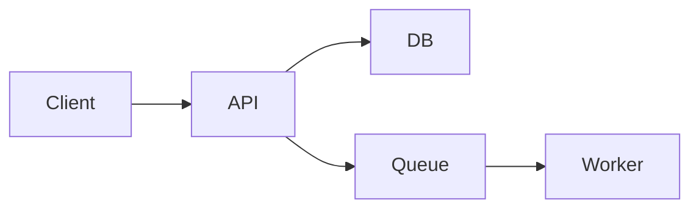

# SKILL : Rédaction de Spécifications

Ce skill standardise la façon d'écrire une spec — parce qu'une spec floue = 3× le temps de dev et des bugs assurés.

## Quand utiliser ce skill

- Avant de coder une feature (PRD + spec technique)
- Avant d'intégrer un service tiers (contrat d'interface)
- Avant une migration de données (plan + rollback)
- Avant un refactor significatif (ADR + spec de l'état cible)

## Principe central

**Une spec est lue par quelqu'un qui n'était pas dans la conversation.** Écris pour ce lecteur-là. Si un détail n'est pas écrit, il n'existe pas.

## Les 4 niveaux de spec

| Niveau | Qui écrit | Qui lit | Focus |
|--------|-----------|---------|-------|
| **PRD** | CPO | Design, Dev, QA | Quoi + pourquoi |
| **Design spec** | Design | Dev | UI/UX détaillé |
| **Tech spec** | Dev lead | Dev, QA | Comment + architecture |
| **Test plan** | QA | Dev | Comment on vérifie |

Les 4 sont complémentaires. Pas de saut d'étape.

## PRD — template minimal

```markdown
# PRD-XXX : [Nom feature]

## Contexte (pourquoi)
[Quel problème utilisateur on résout ? Preuves ?]

## Users ciblés
[Persona + segment précis]

## Solution fonctionnelle
[Description en langage non technique, comme si on l'expliquait à un client]

## User stories
- En tant que [rôle], je veux [action] afin de [bénéfice].

## Parcours utilisateur heureux
1. L'utilisateur [...]
2. Le système [...]
3. L'utilisateur voit [...]

## Parcours d'erreur
- Si [condition], alors [comportement attendu]

## Critères d'acceptation (testables)
- [ ] GIVEN [contexte] WHEN [action] THEN [résultat]
- [ ] ...

## Métriques de succès
[1-3 KPI mesurables, avec valeur cible]

## Hors périmètre (non-goals)
- Ce que cette feature NE fait PAS
- Ce qui viendra peut-être plus tard

## Risques
- Technique : [...]
- UX : [...]
- Business : [...]

## Dépendances
[Autres features, équipes, services]
```

## Tech spec — template minimal

```markdown
# TECH-SPEC : [Nom feature]
Référence : PRD-XXX

## Architecture

### Schéma haut niveau


### Composants modifiés / créés
- `packages/api/src/modules/x/` — nouveau module
- `packages/web/src/features/x/` — nouveaux composants

## Modèle de données

### Nouvelles tables
```sql
CREATE TABLE x (
  id UUID PRIMARY KEY,
  name TEXT NOT NULL,
  created_at TIMESTAMPTZ NOT NULL DEFAULT NOW()
);
CREATE INDEX idx_x_name ON x(name);
```

### Migrations
- Up : ...
- Down : ...
- Rollback plan : ...

## Contrats API

### POST /api/v1/x
Request :
```json
{ "name": "string (1..100)", "parentId": "uuid | null" }
```
Response 201 :
```json
{ "id": "uuid", "name": "...", "createdAt": "ISO" }
```
Errors :
- 400 VALIDATION_ERROR
- 401 UNAUTHORIZED
- 409 CONFLICT (name duplicate)

## Sécurité
- Auth : JWT bearer, scope `x:write`
- Rate limit : 60/min/user
- Audit log : oui, événement `x.created`

## Performance
- P95 cible : < 200ms
- N+1 prévenu : .preload() sur parent

## Monitoring
- Événement tracking : `x_created` (plan de tracking)
- Logs : niveau info sur succès, error sur 5xx
- Alertes : 5xx > 1%/5min → page on-call

## Plan de déploiement
1. Merge → staging automatique
2. Tests QA staging (checklist : [...])
3. Feature flag ON pour 10% des users
4. Monitor 24h
5. Rollout 100% ou rollback

## Rollback
- Feature flag OFF : immédiat
- Migration down : `npm run migrate:down -- x_table`
- Data cleanup : [...]
```

## Spec API externe — format

Pour intégrer un service tiers :
- Endpoint exact + méthode
- Auth (bearer, OAuth, API key, HMAC signed request)
- Headers requis
- Exemple de request/response complet
- Codes d'erreur documentés
- Rate limits
- SLA affiché
- Plan de fallback si indisponible
- Coûts (si payant par appel)

## Rules de rédaction

### Clarté
- Phrases courtes, actives.
- Un paragraphe = une idée.
- Éviter "devrait" — c'est "doit" ou ce n'est pas dans la spec.
- Éviter "etc." — l'exhaustivité est ton métier.

### Testabilité
Chaque requirement doit être traduisible en test. Ex :
- ❌ "Le système doit être rapide"
- ✅ "P95 des réponses < 200ms sur 24h"

### Complétude
Les 5 questions à se poser avant de valider une spec :
1. Le cas d'erreur principal est-il couvert ?
2. Les limites (quotas, tailles) sont-elles explicites ?
3. La sécurité est-elle traitée ?
4. La performance a-t-elle une cible chiffrée ?
5. Le rollback est-il défini ?

## Cycle de revue

1. **Auteur** écrit la v1.
2. **Relecture technique** : Dev lead (pour PRD) ou CTO (pour Tech spec).
3. **Relecture fonctionnelle** : CPO (pour Tech spec) ou Design lead (pour PRD).
4. **Relecture adversariale** : QA lead cherche ce qui peut casser.
5. **Approbation** : PR avec reviews explicites, pas de "LGTM" vide.

## Anti-patterns

- **Spec-as-wishlist** : liste de features sans ordre ni critères.
- **Spec trop détaillée** : spécifier le code ligne par ligne tue l'autonomie dev.
- **Spec jamais mise à jour** : post-implémentation, mettre à jour ou supprimer.
- **Spec sans raison** : la section "pourquoi" est sacrée.
